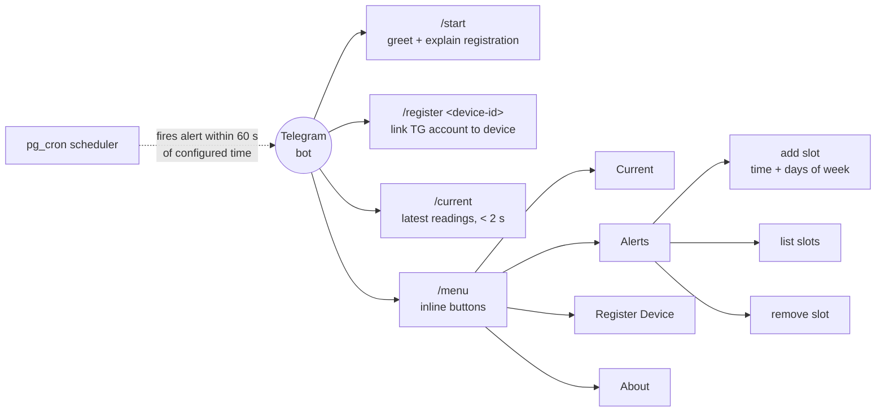
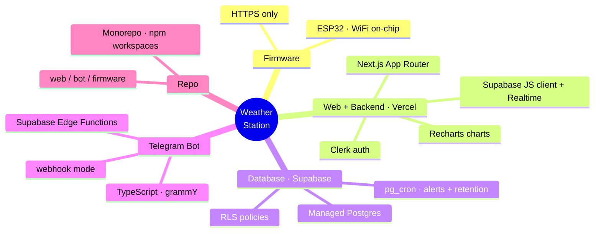

# Step 5 & 6 — Architecture & Tech Stack

## System Architecture

---

## Data Model

```mermaid
erDiagram
    users ||--o{ device_users : "has access via"
    devices ||--o{ device_users : "shared through"
    devices ||--o{ readings : "produces"
    devices ||--o{ readings_daily : "aggregated into"
    users ||--o{ schedules : "configures"

    users {
        uuid id PK
        text clerk_user_id "nullable"
        bigint telegram_id "nullable"
        timestamptz created_at
    }
    devices {
        text device_id PK
        text status "unregistered | registered"
        timestamptz created_at
    }
    device_users {
        text device_id FK
        uuid user_id FK
        text role "owner | editor | viewer"
        timestamptz added_at
    }
    readings {
        bigint id PK
        text device_id FK
        timestamptz timestamp
        float temperature
        float humidity
        float pressure
        float wind_speed
        float wind_direction
        float precipitation
    }
    readings_daily {
        date day PK
        text device_id FK
        float avg_min_max_temp "and humidity, pressure"
        float avg_max_wind_speed
        float total_precipitation
    }
    schedules {
        bigint id PK
        uuid user_id FK
        time time
        text days "bitmask / array"
    }
```

---

## Telegram Bot Commands

```mermaid
flowchart LR
    Bot(("Telegram\nbot"))

    Bot --> Start["/start\ngreet + explain registration"]
    Bot --> Register["/register &lt;device-id&gt;\nlink TG account to device"]
    Bot --> Current["/current\nlatest readings, &lt; 2 s"]
    Bot --> Menu["/menu\ninline buttons"]

    Menu --> MCurrent["Current"]
    Menu --> MAlerts["Alerts"]
    Menu --> MRegister["Register Device"]
    Menu --> MAbout["About"]

    MAlerts --> AAdd["add slot\ntime + days of week"]
    MAlerts --> AList["list slots"]
    MAlerts --> ARemove["remove slot"]

    Scheduler["pg_cron scheduler"] -.->|"fires alert within 60 s\nof configured time"| Bot
```

---

## Tech Stack

```mermaid
mindmap
  root((Weather<br/>Station))
    Firmware
      ESP32 · WiFi on-chip
      HTTPS only
    Web + Backend · Vercel
      Next.js App Router
      Clerk auth
      Recharts charts
      Supabase JS client + Realtime
    Database · Supabase
      Managed Postgres
      RLS policies
      pg_cron · alerts + retention
    Telegram Bot
      TypeScript · grammY
      Supabase Edge Functions
      webhook mode
    Repo
      Monorepo · npm workspaces
      web / bot / firmware
```
