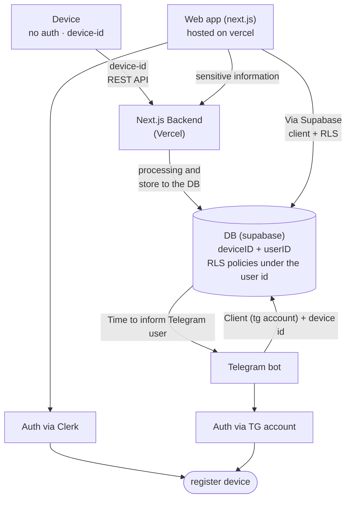

# System Architecture

```mermaid
flowchart TD
    RegDev(["register device"])
    Clerk["Auth via Clerk"]
    TGAuth["Auth via TG account"]
    WebApp["Web app (next.js)\nhosted on vercel"]
    TGBot["Telegram bot"]
    Device["Device\nno auth · device-id"]
    Backend["Next.js Backend\n(Vercel)"]
    DB[("DB (supabase)\ndeviceID + userID\nRLS policies under the user id")]

    Clerk   --> RegDev
    TGAuth  --> RegDev
    WebApp  --> Clerk
    TGBot   --> TGAuth

    Device  -->|"device-id\nREST API"| Backend
    WebApp  -->|"sensitive information"| Backend
    Backend -->|"processing and\nstore to the DB"| DB

    WebApp  -->|"Via Supabase\nclient + RLS"| DB
    TGBot   -->|"Client (tg account) + device id"| DB
    DB      -->|"Time to inform Telegram user"| TGBot
```
